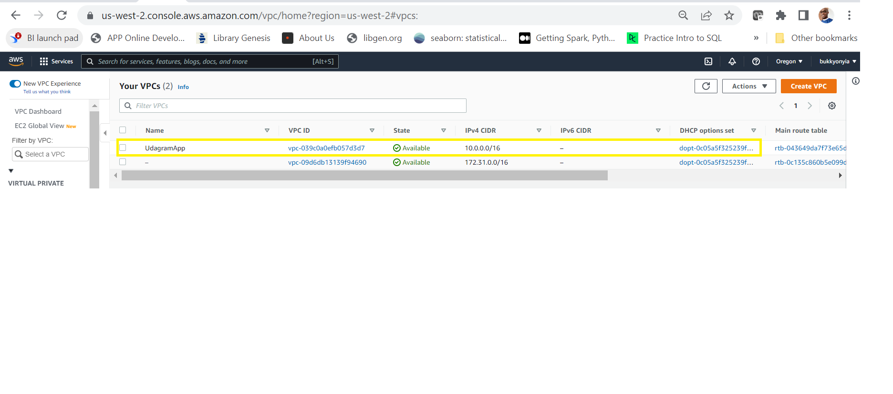
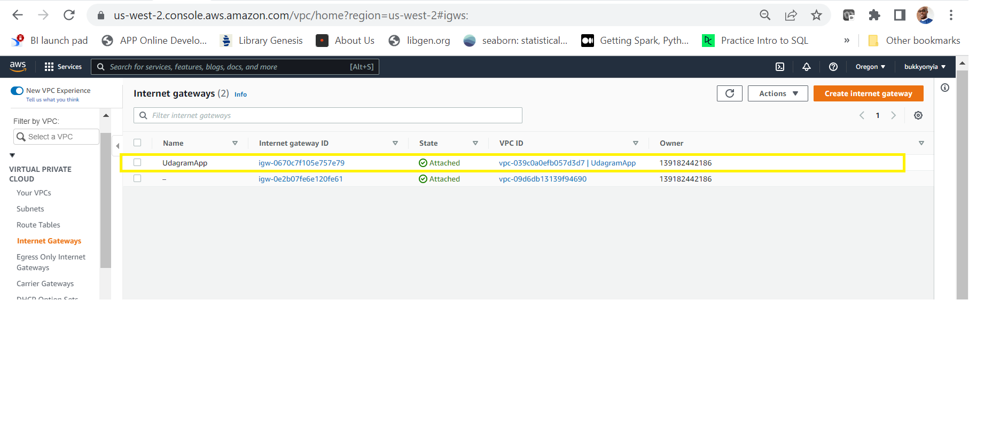

## Project Title - Deploy a high-availability web app(Udagram) using CloudFormation
Take a look at the *Architecture diagram*:

### URL OF LOAD BALANCER- 
- (udagr-WebAp-2NM2YBBQ0VBS-324354963.us-west-2.elb.amazonaws.com)

### This project deploys a high avaliability web application called *UDAGRAM*
    The deployments consist of two stacks:
-  1) udagramNetwork 
-  2) udagramServer

### UdagramNetwork stack
This stack deploys the following resources:
-  A VPC
- A pair of public and private subnets spread across two Availabilty Zones.
- An Internet Gateway, with a default route on the public subnets. 
- route tables for the public 
- A pair of NAT Gateways (one in each AZ), and default routes for them in the private   subnets.

### diagram showing how UdagramNetwork stack was deployed

### diagram showing resources created

### UdagramsServer stack
- A load balancer and web server security groups
- .It also deploys auto scaling groups and its lunch configuration
- In addition, we have load balancers, listeners, listeners rule,target groups, IAM roles and policies.

### diagram showing how UdagramNetwork stack was deployed

### diagram showing resources created

